## Java异常


异常有两种,分别是运行时异常`RuntimeException`和编译时异常

 异常的最上层父类时：`Exception`

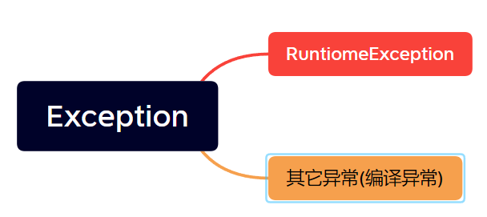

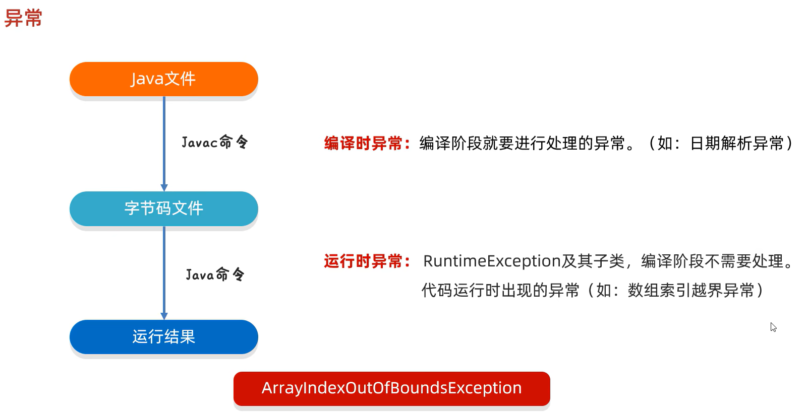

throw 抛出异常

捕获异常:`try{}catch(){}`

程序出现异常，如果没有捕获jvm就会报错，并且异常之后的代码都会不运行。

> 如果在`try{}`里面出现异常，之后所在的代码块里的代码都不会运行.直接跳转到catch...


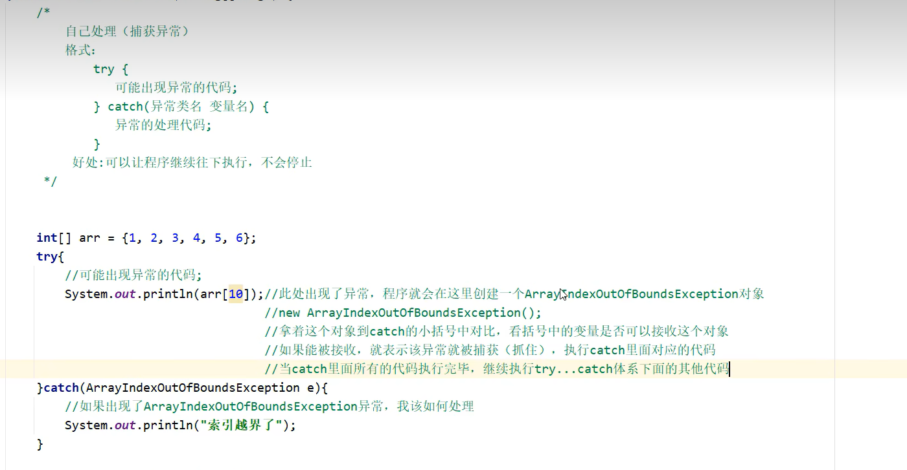

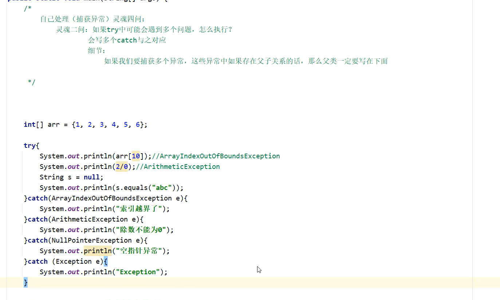

---


在JDK7以后，我们可以在一个catch中捕获多种异常.

> 例如：要捕获两种不同的异常，但它们的处理方式是一样的，可以这么写：

```java
try{
    int a = 2/0;
    throw new ArrayIndexOutOfBoundsException();
}catch (ArithmeticException | ArrayIndexOutOfBoundsException e){
    System.out.println(e);
}
```

__异常的方法__:

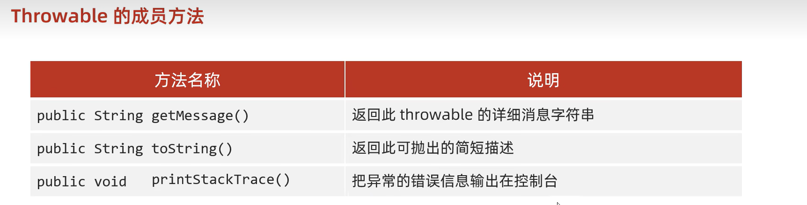

**自定义异常**

1. 定义异常类
2. 写继承关系
3. 空参构造
4. 带参构造


## File

**构造方法**:

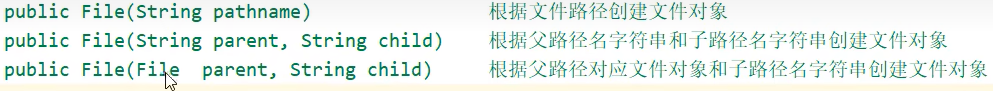

 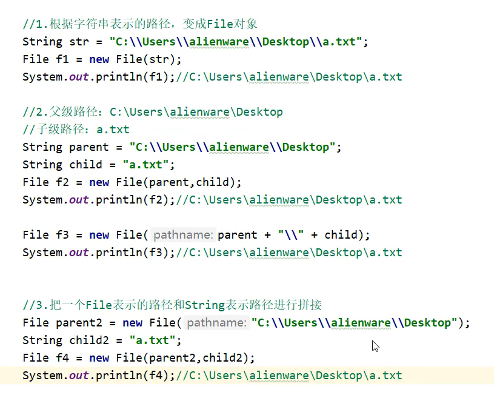

一些**成员方法**：

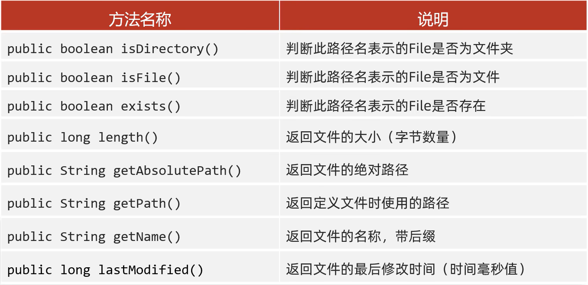

`mkdir()`只能一级一级的创建
`mkdirs()` 可以一次性创建多级文件夹

> 所以一般用`mkdirs()`

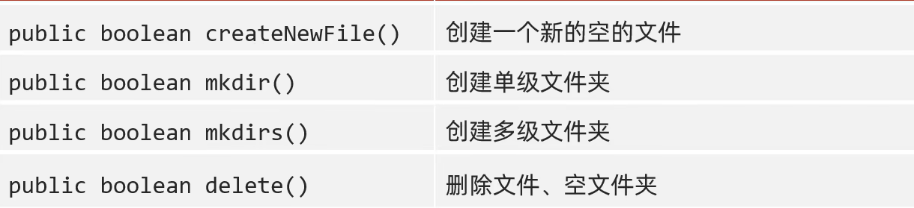

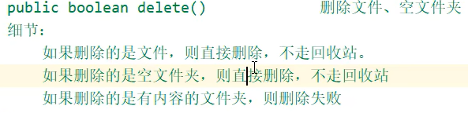

---


`File[] listfiles()` 获取该路径下的所有内容

* 路径不存在时,返回null

* 路径是文件时,返回null

* 路径是需要权限才能访问的文件夹时,返回null

* 路径是空文件时,返回长度为0的数组

* **路径是有内容的文件夹时,将里面所有的文件和文件夹的路径放到File[]数组中返回(包含隐藏文件🫣)**

  
  

  **示例：输出某个路径下的txt文件**

  普通做法:

  ```java
  File desktopPath = new File("C:\\Users\\za\\Desktop");
  File[] files = desktopPath.listFiles();
  if (files != null) {
      for (File file : files) {
          if (file.isFile() && file.getName().endsWith(".txt")) {
              System.out.println(file);
          }
      }
  }
  ```
  
  利用过滤器：
  
  ```java
  File desktopPath = new File("C:\\Users\\za\\Desktop");
  File[] txtFiles = desktopPath.listFiles(new FileFilter() {
      @Override
      public boolean accept(File f) {
          return f.isFile() && f.getName().endsWith(".txt");
      }
  });
  System.out.println(Arrays.toString(txtFiles));
  ```

---


## IO流


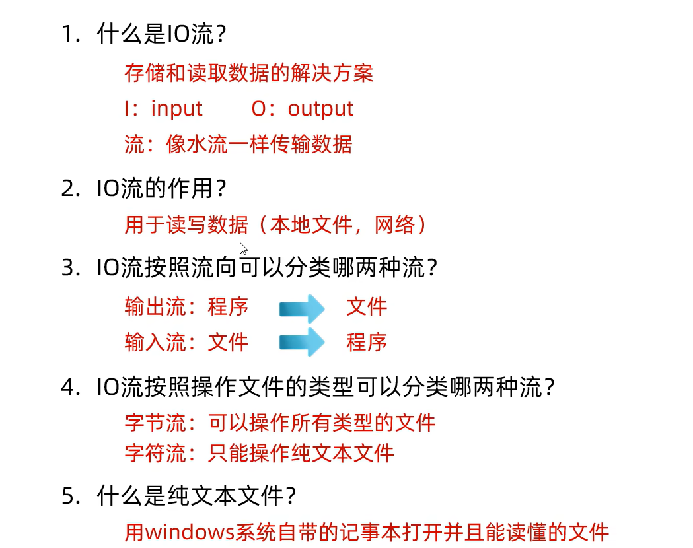


写数据：


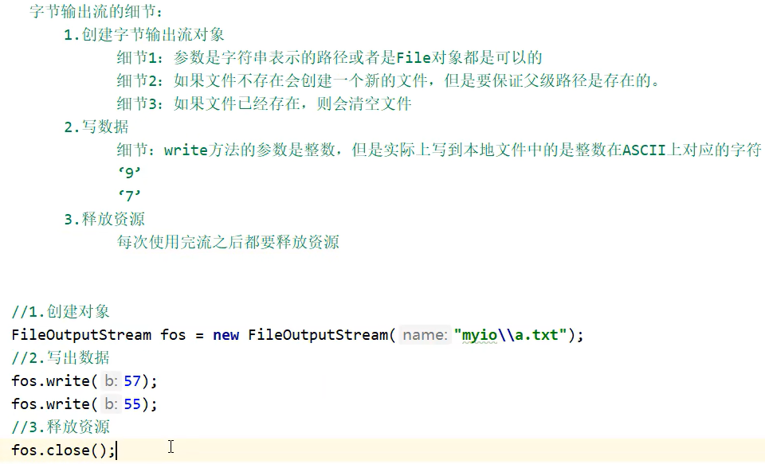

构造的第二个参数填入true表示续写，则不会情况文件

```java
FileOutputStream f = new FileOutputStream(desktopPath,true);
```

__换行:`\r\n`__


读数据：

```java
FileInputStream f = new FileInputStream(desktopPath);
int b;
//read()返回读到多少个字节的数据
//没读到数据返回-1
while ((b = f.read()) != -1){
	System.out.print((char) b);
}
f.close();
```

copy:

JKD9之后,实现了AutoCloseable接口的类捕获异常的写法(会自动close):

```
File desktopTxt1 = new File("C:\\Users\\za\\Desktop\\test.txt");
File desktopTxt2 = new File("C:\\Users\\za\\Desktop\\test2.txt");

FileInputStream in = new FileInputStream(desktopTxt1);
FileOutputStream out = new FileOutputStream(desktopTxt2);

try (in; out) {
    //copy
    int len;
    byte[] bytes = new byte[1024 * 1024 * 10];
    while ((len = in.read(bytes)) != -1) {
        out.write(bytes, 0, len);
    }
} catch (IOException e) {
    e.printStackTrace();
}
```


GBK字符集:
一个汉字使用两字节存储(二进制以1开头)，一个英文使用一个字节存储(二进制以0开头)，兼容ascll

Unicode字符集:
UFT - 8（编码格式）: 编码用1~4字节保存,ascll用1个字节，中文用3个字节.英文二进制第一位是0，中文二进制第一位是1

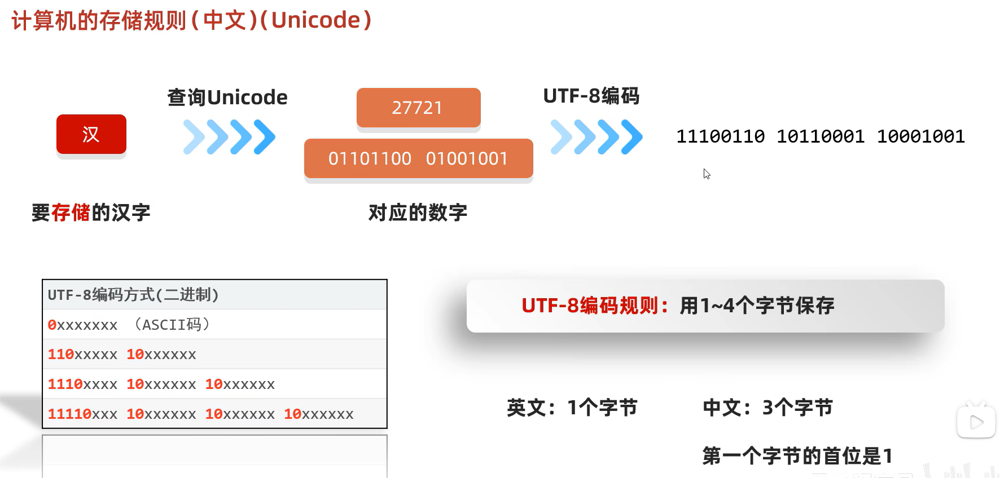

Java中的编码、解码方式（默认使用utf-8）：

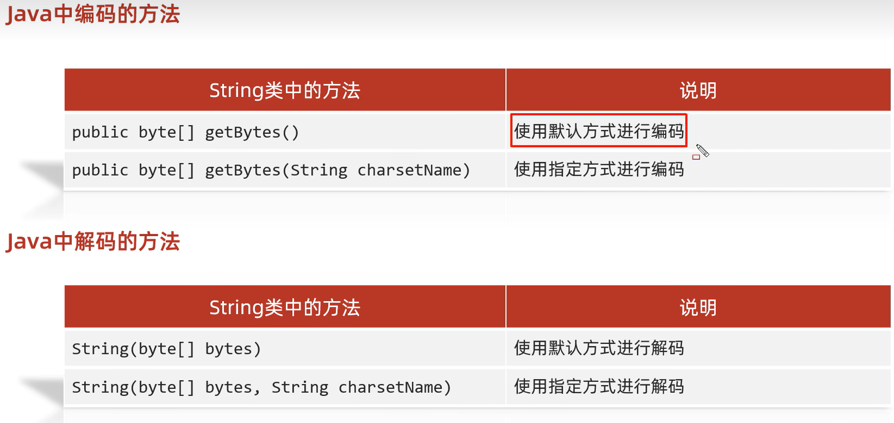

字符流

Reader


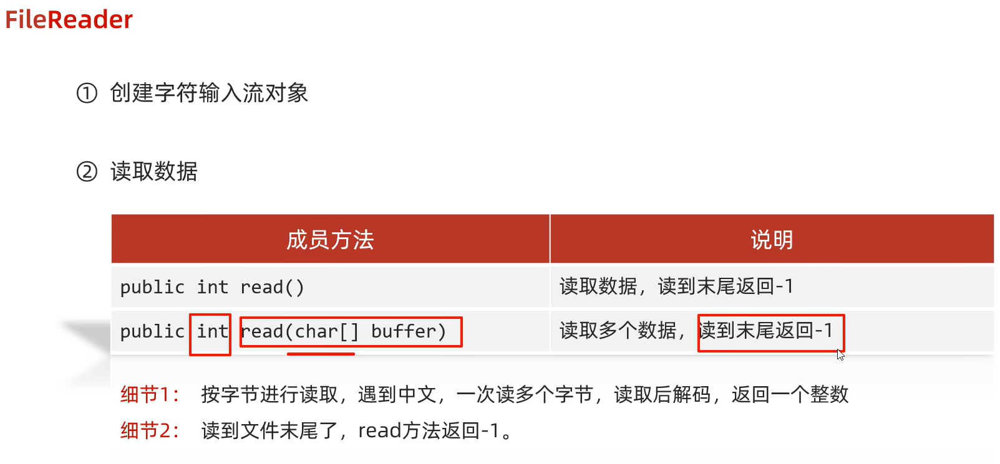
