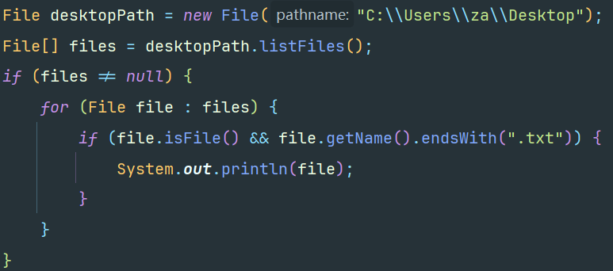
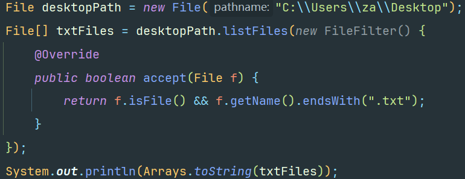
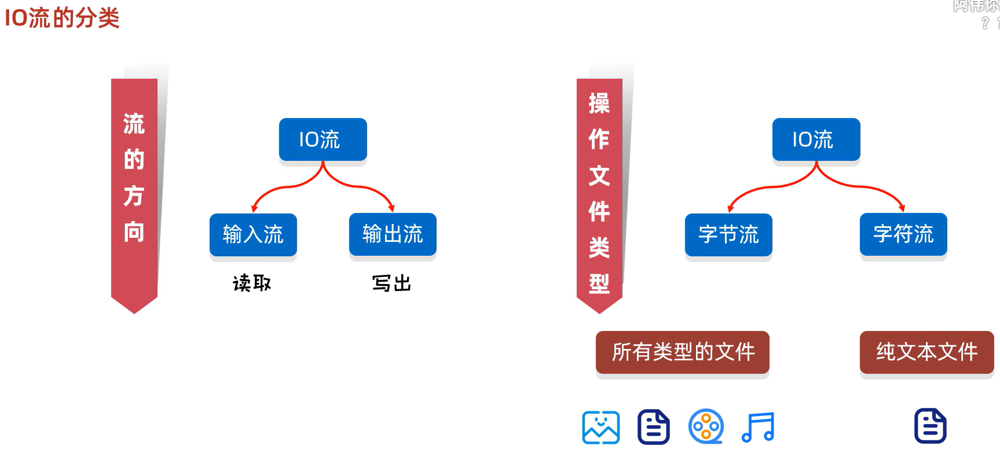

## Java异常


异常有两种,分别是运行时异常`RuntimeException`和编译时异常

 异常的最上层父类时：`Exception`


throw 抛出异常

捕获异常:`try{}catch(){}`

程序出现异常，如果没有捕获jvm就会报错，并且异常之后的代码都会不运行。

> 如果在`try{}`里面出现异常，之后所在的代码块里的代码都不会运行.直接跳转到catch...


---


在JDK7以后，我们可以在一个catch中捕获多种异常.

> 例如：要捕获两种不同的异常，但它们的处理方式是一样的，可以这么写：

```
try{
    int a = 2/0;
    throw new ArrayIndexOutOfBoundsException();
}catch (ArithmeticException | ArrayIndexOutOfBoundsException e){
    System.out.println(e);
}
```

__异常的方法__:


**自定义异常**

1. 定义异常类
2. 写继承关系
3. 空参构造
4. 带参构造


## File

**构造方法**:


 

一些**成员方法**：


`mkdir()`只能一级一级的创建
`mkdirs()` 可以一次性创建多级文件夹

> 所以一般用`mkdirs()`


---


`File[] listfiles()` 获取该路径下的所有内容

* 路径不存在时,返回null

* 路径是文件时,返回null

* 路径是需要权限才能访问的文件夹时,返回null

* 路径是空文件时,返回长度为0的数组

* **路径是有内容的文件夹时,将里面所有的文件和文件夹的路径放到File[]数组中返回(包含隐藏文件)**

  
  

  **示例：输出某个路径下的txt文件**

  普通做法:

  

  利用过滤器：
  

---


## IO流


