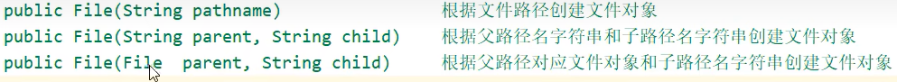
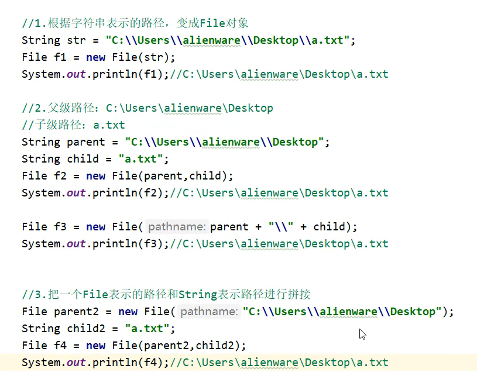
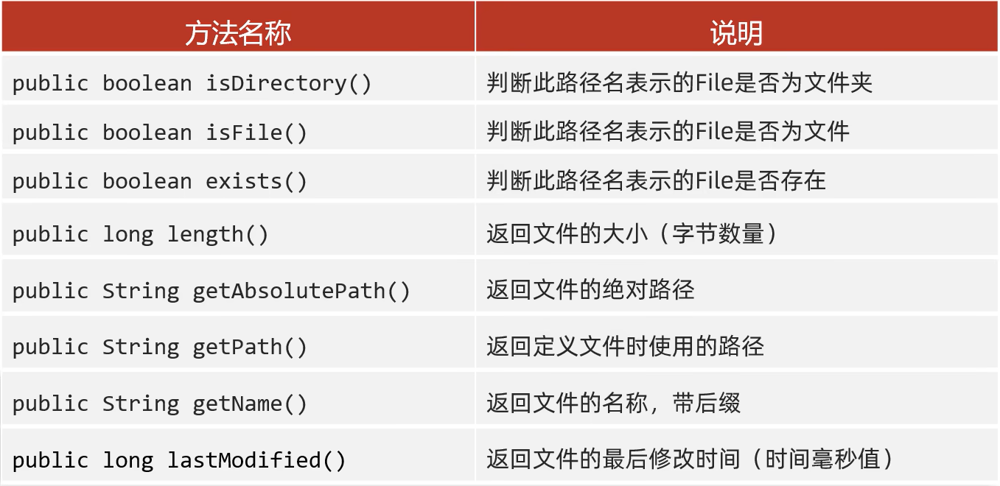
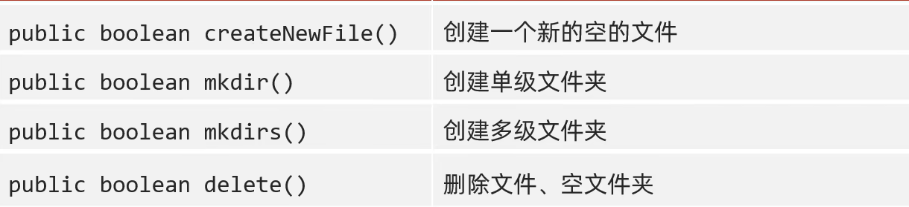
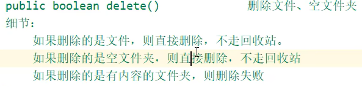

## File

**构造方法**:



 

一些**成员方法**：



`mkdir()`只能一级一级的创建
`mkdirs()` 可以一次性创建多级文件夹

> 所以一般用`mkdirs()`





---


`File[] listfiles()` 获取该路径下的所有内容

* 路径不存在时,返回null

* 路径是文件时,返回null

* 路径是需要权限才能访问的文件夹时,返回null

* 路径是空文件时,返回长度为0的数组

* **路径是有内容的文件夹时,将里面所有的文件和文件夹的路径放到File[]数组中返回(包含隐藏文件🫣)**

  


  **示例：输出某个路径下的txt文件**

  普通做法:

  ```java
  File desktopPath = new File("C:\\Users\\za\\Desktop");
  File[] files = desktopPath.listFiles();
  if (files != null) {
      for (File file : files) {
          if (file.isFile() && file.getName().endsWith(".txt")) {
              System.out.println(file);
          }
      }
  }
  ```

  利用过滤器：

  ```java
  File desktopPath = new File("C:\\Users\\za\\Desktop");
  File[] txtFiles = desktopPath.listFiles(new FileFilter() {
      @Override
      public boolean accept(File f) {
          return f.isFile() && f.getName().endsWith(".txt");
      }
  });
  System.out.println(Arrays.toString(txtFiles));
  ```

---

