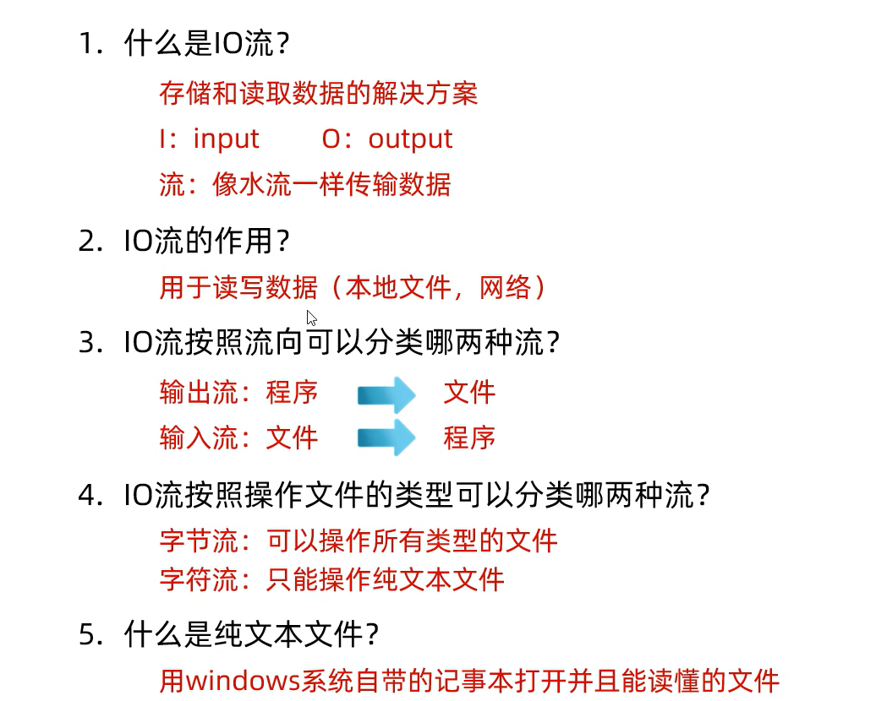
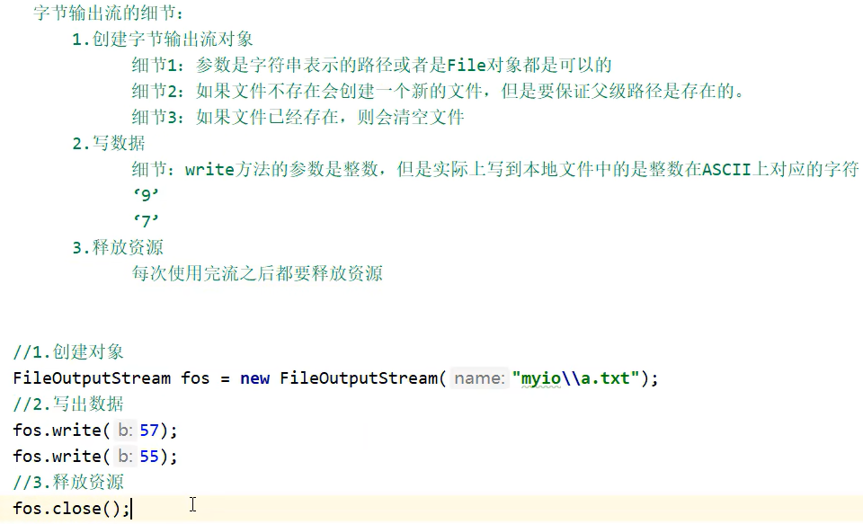

## IO流





写数据：




构造的第二个参数填入true表示续写，则不会情况文件

```java
FileOutputStream f = new FileOutputStream(desktopPath,true);
```

__换行:`\r\n`__


读数据：

```java
FileInputStream f = new FileInputStream(desktopPath);
int b;
//read()返回读到多少个字节的数据
//没读到数据返回-1
while ((b = f.read()) != -1){
	System.out.print((char) b);
}
f.close();
```

copy:

JKD9之后,实现了AutoCloseable接口的类捕获异常的写法(会自动close):

```java
File desktopTxt1 = new File("C:\\Users\\za\\Desktop\\test.txt");
File desktopTxt2 = new File("C:\\Users\\za\\Desktop\\test2.txt");

FileInputStream in = new FileInputStream(desktopTxt1);
FileOutputStream out = new FileOutputStream(desktopTxt2);

try (in; out) {
    //copy
    int len;
    byte[] bytes = new byte[1024 * 1024 * 10];
    while ((len = in.read(bytes)) != -1) {
        out.write(bytes, 0, len);
    }
} catch (IOException e) {
    e.printStackTrace();
}
```


GBK字符集:
一个汉字使用两字节存储(二进制以1开头)，一个英文使用一个字节存储(二进制以0开头)，兼容ascll

Unicode字符集:
UFT - 8（编码格式）: 编码用1~4字节保存,ascll用1个字节，中文用3个字节.英文二进制第一位是0，中文二进制第一位是1


Java中的编码、解码方式（默认使用utf-8）：


字符流


字节缓存流


字符缓冲流


