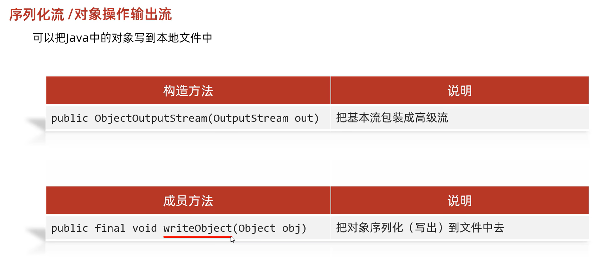

## IO流


写数据：


构造的第二个参数填入true表示续写，则不会情况文件

```java
FileOutputStream f = new FileOutputStream(desktopPath,true);
```

__换行:`\r\n`__


读数据：

```java
FileInputStream f = new FileInputStream(desktopPath);
int b;
//read()返回读到多少个字节的数据
//没读到数据返回-1
while ((b = f.read()) != -1){
	System.out.print((char) b);
}
f.close();
```

copy:

JKD9之后,实现了AutoCloseable接口的类捕获异常的写法(会自动close):

```java
File desktopTxt1 = new File("C:\\Users\\za\\Desktop\\test.txt");
File desktopTxt2 = new File("C:\\Users\\za\\Desktop\\test2.txt");

FileInputStream in = new FileInputStream(desktopTxt1);
FileOutputStream out = new FileOutputStream(desktopTxt2);

try (in; out) {
    //copy
    int len;
    byte[] bytes = new byte[1024 * 1024 * 10];
    while ((len = in.read(bytes)) != -1) {
        out.write(bytes, 0, len);
    }
} catch (IOException e) {
    e.printStackTrace();
}
```


GBK字符集:
一个汉字使用两字节存储(二进制以1开头)，一个英文使用一个字节存储(二进制以0开头)，兼容ascll

Unicode字符集:
UFT - 8（编码格式）: 编码用1~4字节保存,ascll用1个字节，中文用3个字节.英文二进制第一位是0，中文二进制第一位是1


Java中的编码、解码方式（默认使用utf-8）：


#### 字符流


字节缓存流


字符缓冲流


#### 转换流

以指定的字符编码读取数据

注意:FileReader/FileWriter指定字符编码是JDK11之后才有的

字符转换输入流:`InputStreamReader`

字符转换输出流:`OutputStreamWriter` 


#### 序列化流(对象操作输出流)

可以把java中的对象写到本地文件中




如果一个类实现了Serializable接口,那么说明这个类是可被序列化的

设置JavaBean的序列号
`private static final long serialVersionUID = 123;`

```java
//    序列化流
        Student stu = new Student(18,"张三");
        ObjectOutputStream oos = new ObjectOutputStream(
                new FileOutputStream("C:\\Users\\za\\Desktop\\iotest.txt"));
        oos.writeObject(stu);
        oos.close();
//反序列化流
        ObjectInputStream ois = new ObjectInputStream(
                new FileInputStream("C:\\Users\\za\\Desktop\\iotest.txt"));
        Student s = (Student)ois.readObject();
        System.out.println(s);
        ois.close();
```

关键字:`transient`变量前面加了这个关键字,就不会把当前属性序列化到本地文件


如果有多个对象,可以放进List中再序列化,这样"读"起来就方便多了


#### 打印流

打印流一般是指:PrintStream(字节打印流).PrintWriter(字符打印流)两个类

特点:打印流只操作文件的目的地,不操作数据源

特有的写出方法可以实现,数据原样写出

例如:打印97  文件中:97

特有的写出方法,可以实现自动刷新,自动换行


字节打印流没有缓冲区


字符打印流有缓冲区,想要自动刷新需要开启


#### 解压缩流/压缩流

解压


压缩


#### Commons-io 工具包


#### Hutool工具包

[中文官网](https://doc.hutool.cn/pages/index/)


