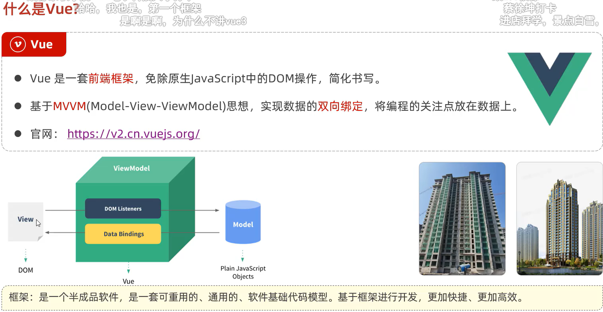
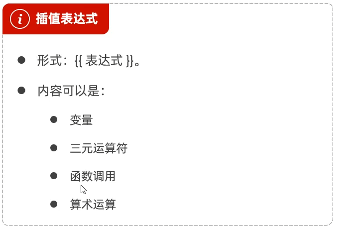
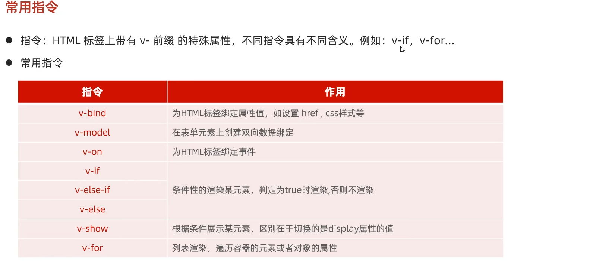
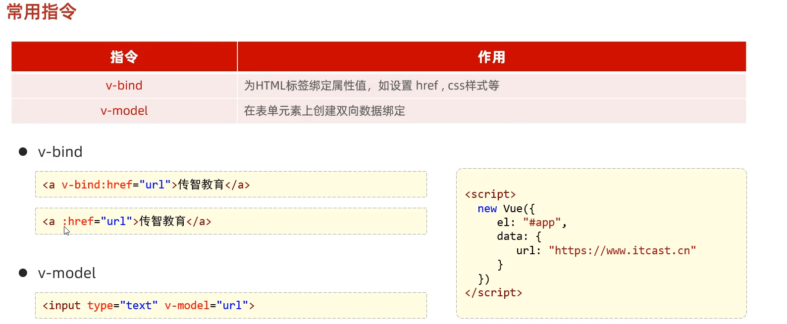
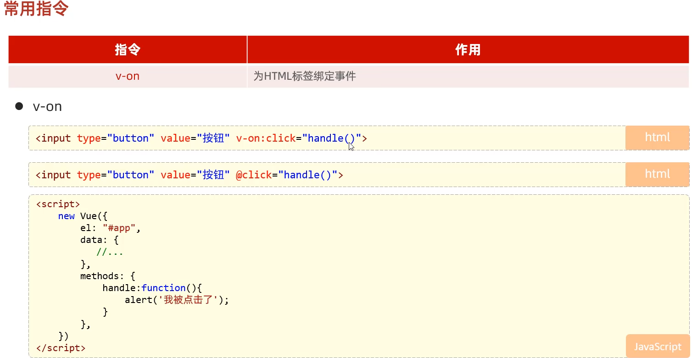
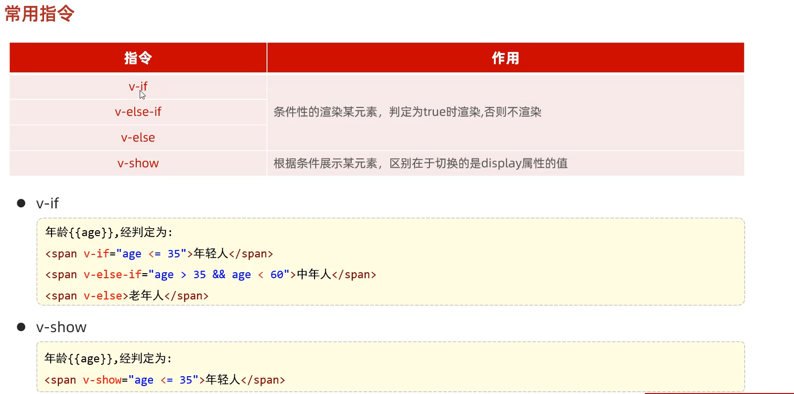
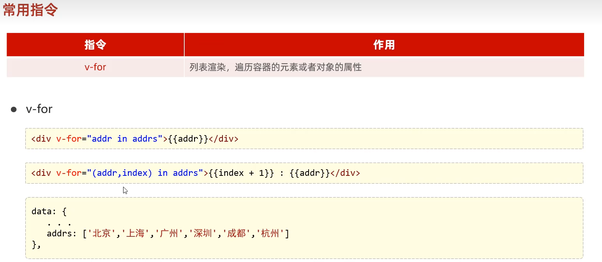
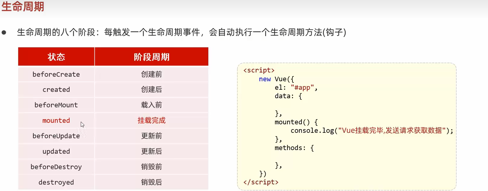
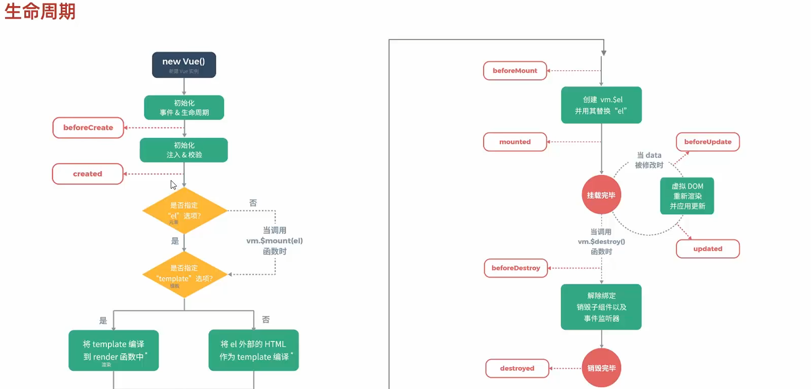

```html
	<div id = "app" >
        <input type="text" v-model = "message">
        {{message}}
    </div>
```


```vue
//双向数据绑定
new Vue({
        el:"#app",//vue接管区域
        data:{
            message:"Hello Vue"
        }
    })
```








```html
<div id = "app" >
    //v-on:click 绑定点击事件 可简写为@click
    <input type="button" value="点我" v-on:click = 		"btnClick()">
</div>
```


```js
	new Vue({
        el:"#app",//vue接管区域
        methods : {
            btnClick : function(){
                alert("button click!");
            }
        }
    })
```






案例1: 将数据呈现到表格


```html
<table id = "table">
        <tr>
            <th>编号</th>
            <th>姓名</th>
            <th>年龄</th>
            <th>性别</th>
            <th>成绩</th>
            <th>等级</th>
        </tr>
        <tr v-for = "(user,index) in user">
            <td>{{index + 1}}</td>
            <td>{{user.name}}</td>
            <td>{{user.age}}</td>
            <td>
                <span v-if = "user.gender == 1">男</span>
                <span v-else>女</span>
            </td>
            <td>{{user.score}}</td>
            <td>    
                <span v-if = "user.score >= 80">优秀</span>
                <span v-else-if = "user.score >= 65">良好</span>
                <span v-else>不及格</span>
            </td>
        </tr>
    </table>
```

```js
new Vue({
        el:"#table",
        data:{
            user : [
                {
                    name : "张三",
                    age : 23,
                    gender : 1,
                    score : 88
                },{
                    name : "李四",
                    age : 21,
                    gender : 2,
                    score : 68
                },{
                    name : "王五",
                    age : 33,
                    gender : 1,
                    score : 48
                }
            ]
        }
    })
```


vue 的生命周期




