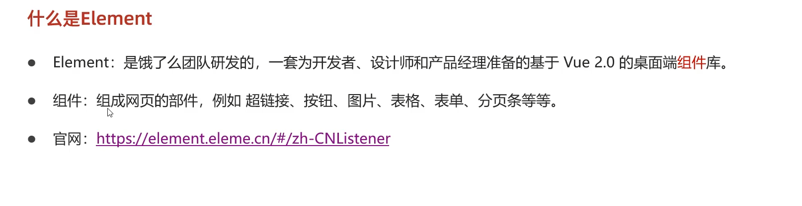
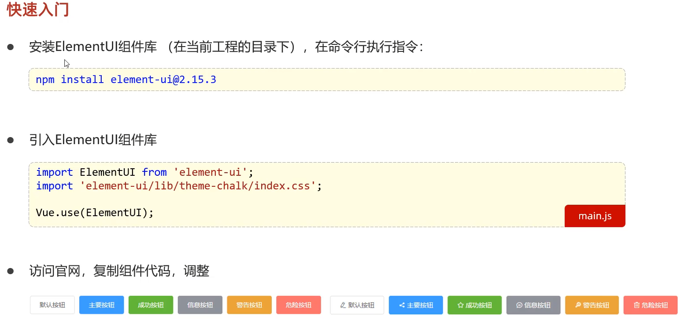
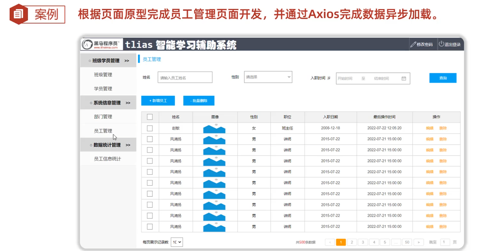
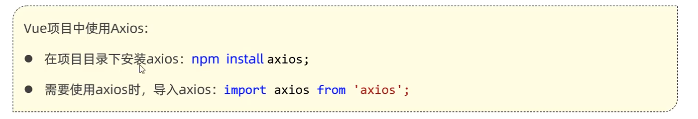

官网:https://element.eleme.cn/#/zh-CN


```vue

<template>
  <div>
      <element-view>

      </element-view>
    <!-- <h1>{{message}}</h1> -->
  </div>
</template>

<script>
import ElementView from './views/element/ElementView.vue'
export default{
  components:{ElementView},
  data(){
    return {
        message : "hello world!"
    }
  },
  mothods(){
    return {

    }
  }
}
</script>

<style>

</style>

```


常见组件


table
```vue
<template>
    <div class="content">
        //注意要包裹进div里,否则会报错
        <el-table :data="tableData" style="width: 80%">
            <el-table-column prop="date" label="日期" width="180">
            </el-table-column>
            <el-table-column prop="name" label="姓名" width="180">
            </el-table-column>
            <el-table-column prop="address" label="地址">
            </el-table-column>
        </el-table>
    </div>
</template>
<script>
export default {
    data() {
        return {
            tableData: [{
                date: '2016-05-02',
                name: '王小虎',
                address: '上海市普陀区金沙江路 1518 弄'
            }, {
                date: '2016-05-04',
                name: '王小虎',
                address: '上海市普陀区金沙江路 1517 弄'
            }, {
                date: '2016-05-01',
                name: '王小虎',
                address: '上海市普陀区金沙江路 1519 弄'
            }, {
                date: '2016-05-03',
                name: '王小虎',
                address: '上海市普陀区金沙江路 1516 弄'
            }]
        }
    }
}
</script>
<style>
.content {
    width: 50%;
    margin: auto;
}
</style>
```


分页


```vue

<template>
    <div class="content">
        <el-table :data="tableData" style="width: 80%">
            <el-table-column prop="date" label="日期" width="180">
            </el-table-column>
            <el-table-column prop="name" label="姓名" width="180">
            </el-table-column>
            <el-table-column prop="address" label="地址">
            </el-table-column>
        </el-table>
        <el-pagination background layout="total,jumper, prev, pager, next" @size-change="handleSizeChange"
            @current-change="handleCurrentChange" :total="99">
        </el-pagination>
    </div>
</template>
<script>
export default {
    data() {
        return {
            tableData: [{
                date: '2016-05-02',
                name: '王小虎',
                address: '上海市普陀区金沙江路 1518 弄'
            }, {
                date: '2016-05-04',
                name: '王小虎',
                address: '上海市普陀区金沙江路 1517 弄'
            }, {
                date: '2016-05-01',
                name: '王小虎',
                address: '上海市普陀区金沙江路 1519 弄'
            }, {
                date: '2016-05-03',
                name: '王小虎',
                address: '上海市普陀区金沙江路 1516 弄'
            }]
        }
    },
    methods: {
        handleSizeChange: function (val) {
            alert("分页" + val);
        },
        handleCurrentChange: function (val) {
            alert("2分页" + val);
        }
    },
}
</script>
<style>
.content {
    width: 50%;
    margin: auto;
}
</style>
```


案例: 


