javascript是一门弱类型语言,变量可以存放不同的数据类型
```javascript
//var定义变量,特点作用域比较大,属于全局变量,可以重复定义
var a = 1;
var a = "123";
//let定义变量,特点只在代码块有效(作用域小),且不允许重复声明
{
    let a = 1;
}
// const 定义常量,不能改变
const PI = 3.14;
```


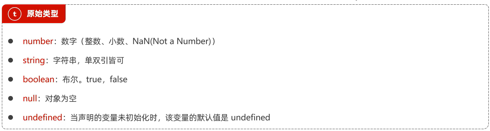

使用typeof运算符获取数据的类型:
	`console.log(typeof "a")` --> string

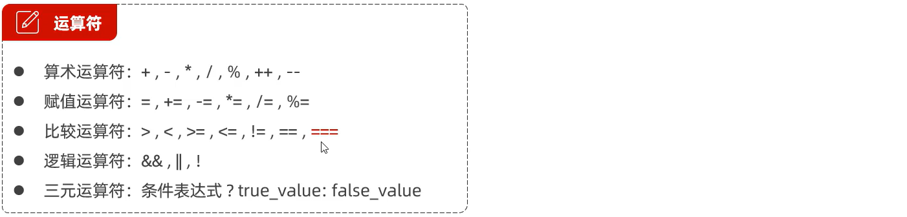

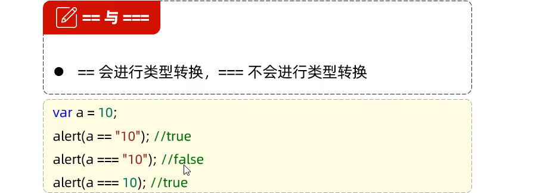

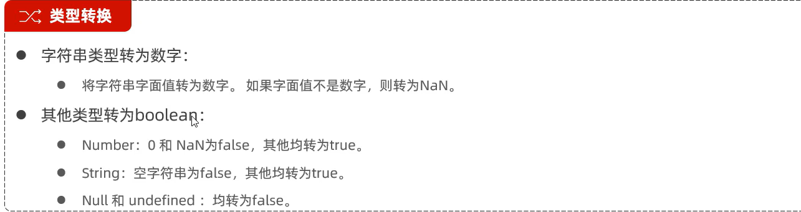

定义函数

```js
function add(a,b){
        return a+b;
    }
var add = function(a,b){...}
```

函数调用的时候可以传递任意个参数


定义数组

```js
var arr = new Array(1,2,3);
var arr1 = [1,2,3];
```

访问数组元素`arr[i]`

数组特点:长度可变,类型可变
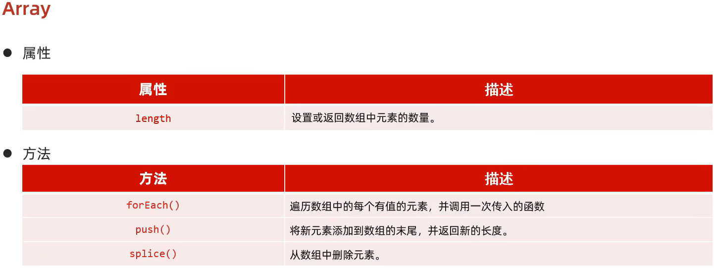

```js
//foreach 遍历有值的元素
    var arr = [1,2,3,4];
    arr.forEach(function(e){
        console.log(e);
    });
//简化上面代码,类似lambda表达式
	arr.forEach( (e) => {
        console.log(e);
    });

//for 循环遍历
    for(let i = 0;i < arr.length;++i){
        console.log(arr[i]);
    }
```

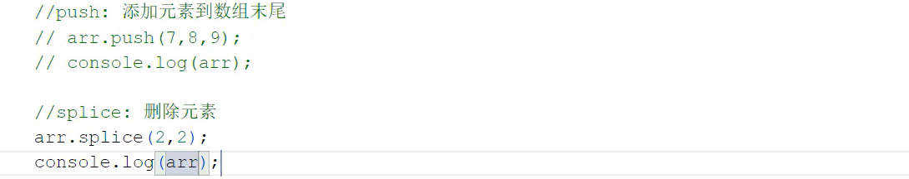

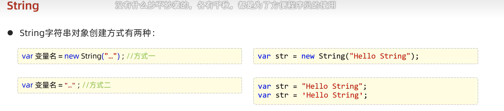

属性跟方法 和java差不多...


对象:

```js
//自定义对象
var user = {
    name : "Tom",
    age : 19,
    eat : function(){
        alert("干饭~");
    }
}
//获取对象的属性,调用对象的方法
alert(user.name);
user.eat();
```


```js
//json 字符串
var userStr = '{"name" : "Jerry","age"  : 18,"addr" : ["北京","上海","南昌"]}';
//json字符串转成js对象
var obj = JSON.parse(userStr);
//js对象转字符串
var Str = JSON.stringify(obj);
```


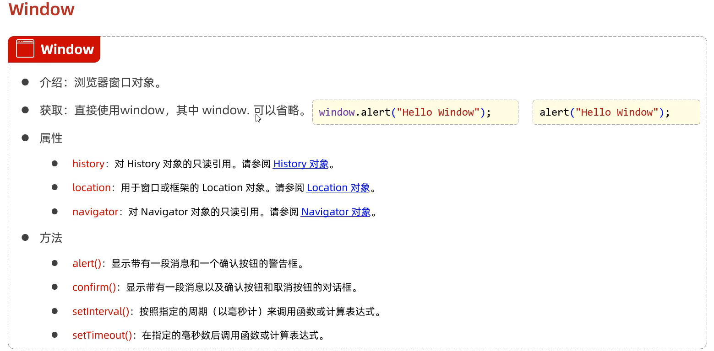

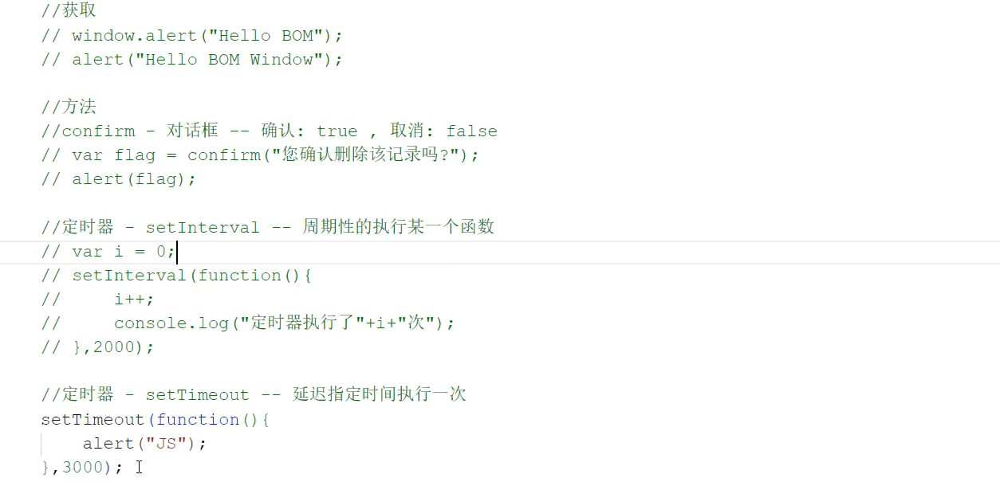

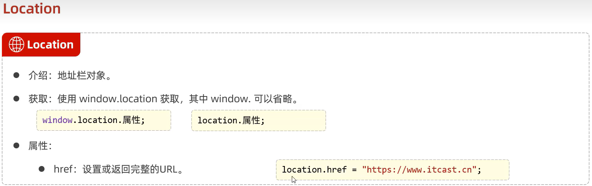

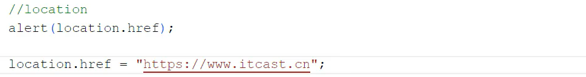

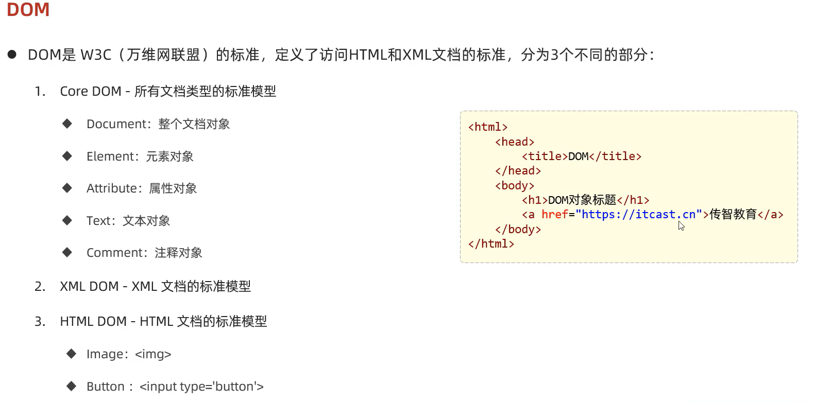

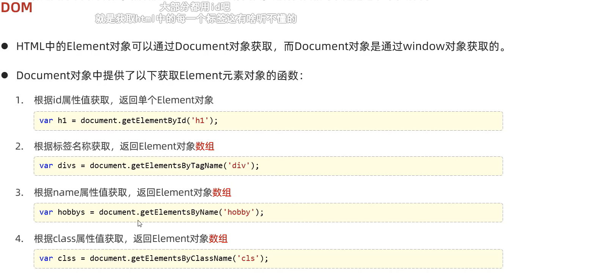

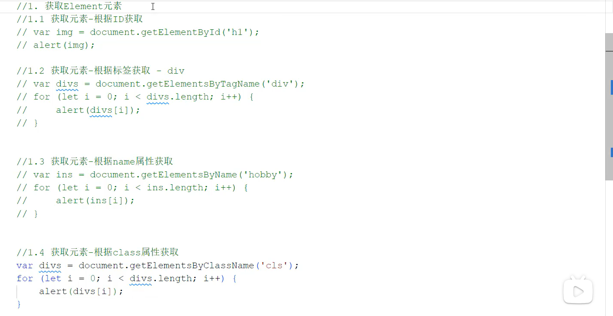

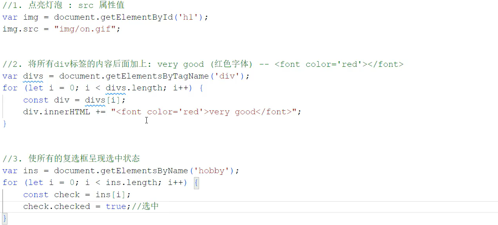


js事件监听

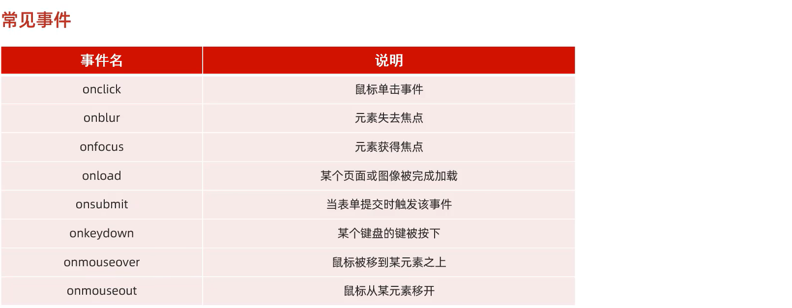

```js
//绑定事件两种办法
<body>
	<button class="btn" onclick="on()">神秘按钮</button>
</body>
<script>
    function on(){
        alert("click button");
    }
</script>
//第二种办法
	let btn = document.getElementsByClassName("btn")[0];
	btn.onclick = function(){code}
```

