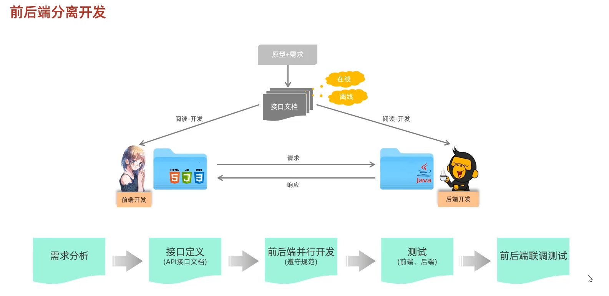
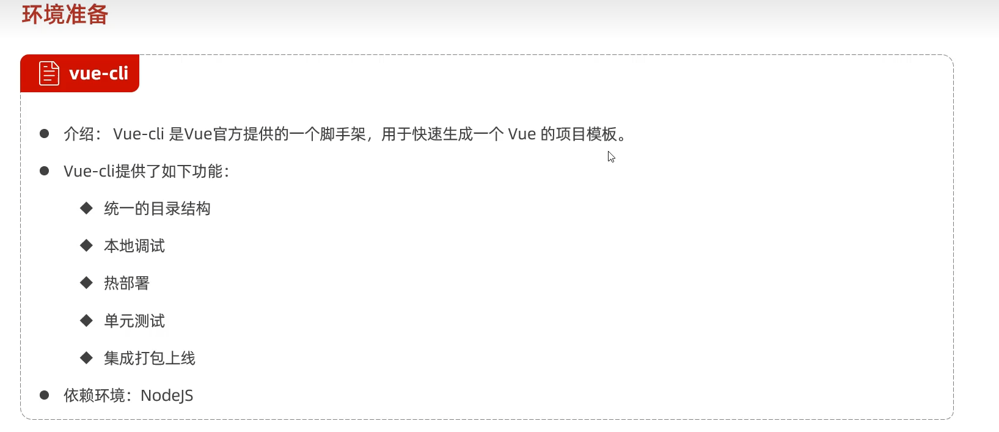
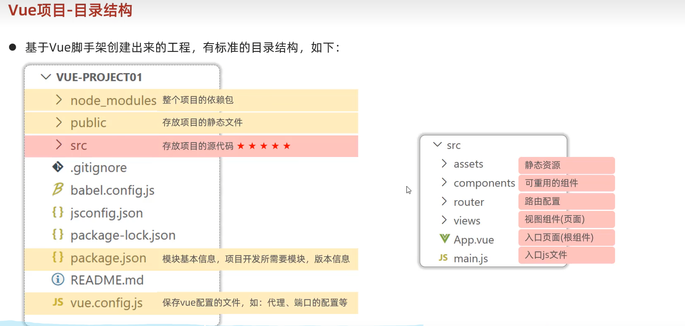
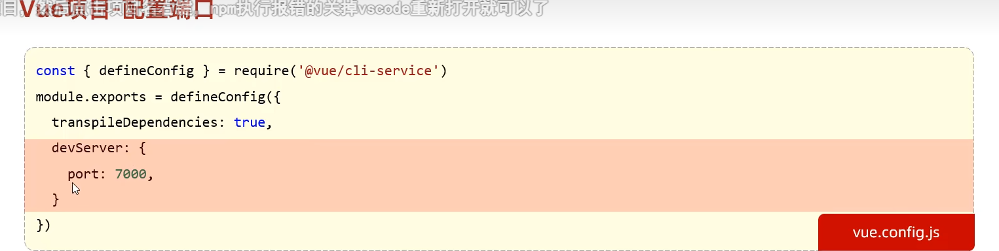
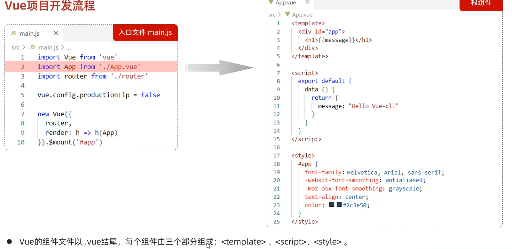

https://app.apifox.com/

在线接口管理平台


vue脚手架





在config文件配置端口




```vue	
//定义html元素
<template>
  <div>
    <h1>{{message}}</h1>
  </div>
</template>
//写js 和 vue
<script>
export default{
  data(){
    return {
        message : "hello world!"
    }
  },
  mothods(){
    return {

    }
  }
}
</script>
//css 样式
<style>

</style>
```

