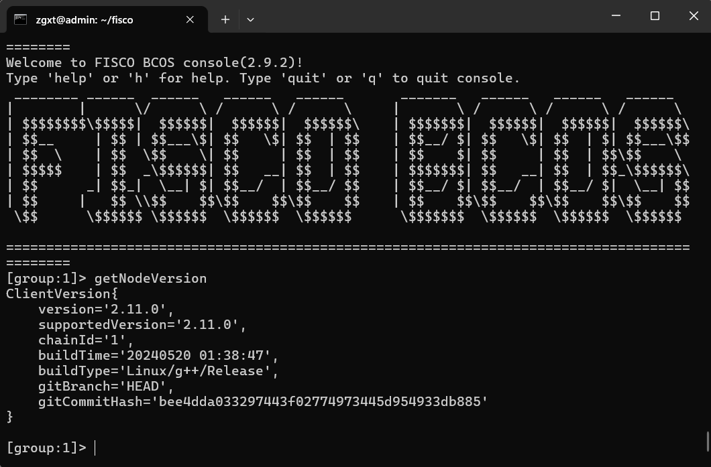

[linux命令大全](https://www.linuxcool.com/)

[linux命令搜索](https://wangchujiang.com/linux-command/)


### 文件

| **`ls -al`**                             | 列出文件-包括常规文件和隐藏文件以及它们的权限                |
| ---------------------------------------- | ------------------------------------------------------------ |
| **`tree`**                               | 以树形结构列出文件，常用参数有：`-d`查看目录，`-L num`查看num层文件，`-a`查看隐藏文件 |
| **`pwd`**                                | 显示当前目录文件路径                                         |
| **`mkdir 'directory_name'`**             | 创建一个新目录                                               |
| **`rm file_name`**                       | 删除一个文件                                                 |
| **`rm -f filename`**                     | 强制删除文件                                                 |
| **`rm -r directory_name`**               | 递归地删除一个目录                                           |
| **`rm -rf directory_name`**              | 强制并递归地删除一个目录                                     |
| **`cp file1 file2`**                     | 将file1的内容复制到file2                                     |
| **`cp -r dir1 dir2`**                    | 递归地将dir1复制到dir2。如果dir2不存在，则创建它             |
| **`mv file1 file2`**                     | 将file1重命名为file2                                         |
| **`ln -s /path/to/file_name link_name`** | 创建到file_name的软链接                                      |
| **`touch file_name`**                    | 创建一个新文件                                               |
| **`cat > file_name`**                    | 从键盘创建一个文件                                           |
| **`more file_name`**                     | 输出文件的内容                                               |
| **`head file_name`**                     | 显示文件的前10行                                             |
| **`tail file_name`**                     | 显示文件的最后10行                                           |
| **`gpg -c file_name`**                   | 加密一个文件                                                 |
| **`gpg file_name.gpg`**                  | 解密文件                                                     |
| **`wc`**                                 | 打印文件中的字节、单词和行数                                 |
| **`xargs`**                              | 从标准输入执行命令                                           |


### 权限

| **`chmod octal filename`**                   | 将文件权限更改为八进制                                       |
| -------------------------------------------- | ------------------------------------------------------------ |
| **`chmod 777 /data/test.c`**                 | 将rwx权限设置为owner、group和everyone(其他可以访问服务器的人) |
| **`chmod 755 /data/test.c`**                 | 将rwx设置为所有者，将r_x设置为组和所有人                     |
| **`chmod 766 /data/test.c`**                 | 为所有者设置rwx，为组和每个人设置rw                          |
| **`chown owner user-file`**                  | 更改文件的所有权                                             |
| **`chown owner-user:owner-group file_name`** | 更改文件的所有者和组所有者                                   |
| **`chown owner-user:owner-group directory`** | 更改目录的所有者和组所有者                                   |


管道符`|`  将前面语句的输出作为后面语句的操作对象

`su username` 切换到指定用户

`su -c 'command' username` 以指定用户的身份执行命令

`su -m username` 保留当前环境变量的切换

命令前面加上`sudo`表示以root的权限输入该命令

| **`>`**  | 覆盖运算符 |
| -------- | ---------- |
| **`>>`** | 追加运算符 |

 **`ifconfig`**   显示所有网络接口的IP地址


&&   表示前面的命令执行成果了才会执行后面的

```linux
//这是一个简单的示例:
mkdir my_directory && cd my_directory
```

如果 `mkdir my_directory` 成功创建了目录 `my_directory`，那么 `cd my_directory` 将会把当前目录切换到 `my_directory`；


mkdir [选项] 目录名

### 常见选项

- `-p`：创建目录结构时，如果需要的父目录不存在，这个选项会自动创建所需的所有父目录。
- `-v`：显示命令执行的详细信息。
- `-m`：设置新建目录的权限（如 `-m 755`）。


find [起始目录] -name [文件名]

**在当前目录及其子目录中查找名为 `example.txt` 的文件**：

```
bash
复制代码
find . -name "example.txt"
```

**在根目录下查找名为 `example.txt` 的文件**：

```
bash
复制代码
find / -name "example.txt"
```

**使用通配符查找所有以 `.txt` 结尾的文件**：

```
bash
复制代码
find /path/to/search -name "*.txt"
```

**区分大小写查找文件（默认）**：

```
bash
复制代码
find /path/to/search -name "Example.txt"
```

**忽略大小写查找文件**：

```
bash
复制代码
find /path/to/search -iname "example.txt"
```


